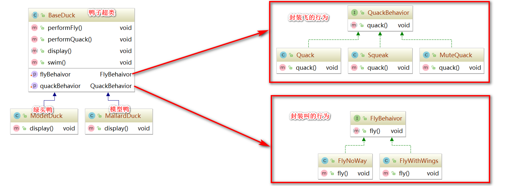
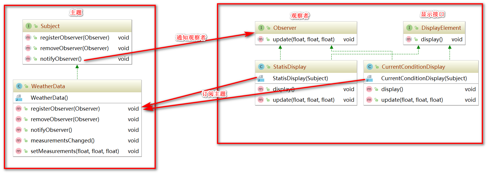
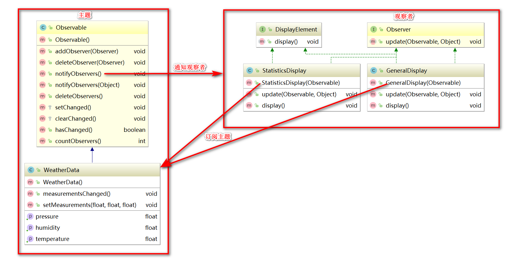
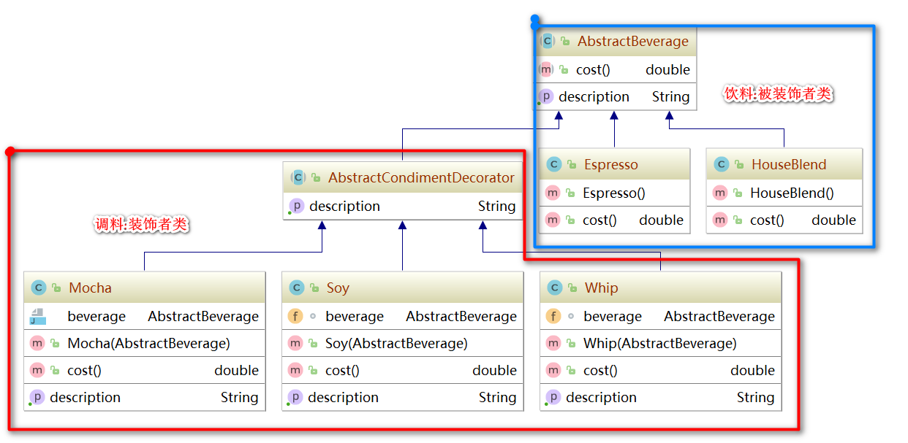
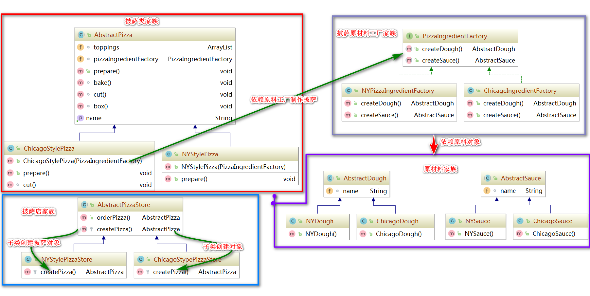

# DesignPattern

## 0 入门

### 1. OO基础

1.  抽象
2. 封装
3. 继承
4. 多态

### 2. OO原则

1. 封装变化
2. 多用组合,少用继承
3. 针对接口编程,不针对实现编程
4. 为交互对象之间的松耦合设计而努力
5. 对扩展开放,对修改关闭
6. 依赖抽象(接口),不要依赖具体实现

### 3. 要点

1. 知道OO的基础,并不足以设计出良好的OO系统
2. 良好的OO设计必须具备可复用,可扩充,可维护三个特性
3. 模式可以让我们建造出具有良好设计质量的系统
4. 模式被认为是历经经验验证的OO设计经验
5. 模式不是代码,而是针对设计问题的通用解决方案
6. 模式不是被发明,而是被发现
7. 大多数的模式和原则,都着眼于**变化**的主题
8. 大多数的模式都允许系统局部改变独立与其他部分
9. 我们常把系统中变化的部分抽取出来封装
10. 模式让开发人员之间有共享的语言,能够最大化沟通的价值

## 1. 策略模式

让变化独立与其他不变的部分

### 1.1 UML类图

[参考代码](src/main/java/cn/itcast/strategy)

## 2. 观察者模式

在对象之间设计一对多的依赖,这样一来,当一个对象改变状态,依赖它的对象都会收到通知,并自动更新

### 2.1 要点

1. 观察者模式定义了对象之间一对多的关系
2. 主题(也就是可观察者)用一个共同的接口来更新观察者
3. 观察者和可观察者之间用松耦合的方式结合,可观察者不知道观察者的细节,只知道观察者实现了观察者接口
4. 使用此模式时,你可从被观察者出推(push)或拉(pull)数据.(推的方式被认为是正确)
5. 有多个观察者时,不可以依赖特定的通知次序
6. Java有多种观察者模式的实现,包括了通用的java.utils.Observerable
7. 要注意Observerable实现上带来的一些问题(使用的继承而不是接口的方式)
8. 如果有必要的话,自定义实现观察者模式,而不是用JDK提供的观察者的支持
9. Swing大量使用观察者模式,许多GUI框架也是如此
10. 此模式也被也应用在许多地方.例如:JavaBeans,RMI

### 2.2 自定义实现

[参考代码](src/main/java/cn/itcast/observer/customer)

### 2.3 JDK内置实现

[参考代码](src/main/java/cn/itcast/observer/jdk)

## 3. 装饰者设计模式

动态地将责任附加到对象上.想要扩展功能,装饰者提供有别与继承的另一种选择.

### 3.1 要点

1. 继承属于扩展形式之一,但不见得是达到弹性设计的最佳方案
2. 在我们的设计中,应该允许行为被扩展,而无须修改现有的代码
3. 组合的委托可用于在运动时动态地加上新的行为
4. 除了继承,装饰者模式也可以让我们扩展行为
5. 装饰者模式意味着一群装饰者类,这些类用来包装具体组件
6. 装饰者类反映出被装饰者的组件类型(事实上,他们具有相同的类型,都经过接口或继承实现)
7. 装饰者可以在被装饰者的行为前面或者后面加上自己的行为,甚至将被装饰者的行为整个取代,而达到特定的目的
8. 你可以用无数个装饰者包装一个组件
9. 装饰者一般对组件的客户是透明的,除非客户程序依赖于组件的具体类型
10. 装饰者会导致设计中出现许多小对象,如果过度使用,会让程序变得复杂

### 3.2 UML类图

[参考代码](src/main/java/cn/itcast/decorator)

## 4. 工厂模式

* 抽象工厂模式:提供一个接口,用于创建相关或依赖对象的家族,而不需要明确指定类
* 工厂方法模式:定义了一个创建对象的接口,但又子类决定要实例化的类是哪一个.工厂方法让类把实例化推迟到子类.

### 4.1 要点

1. 所有工厂都是用来封装对象的创建
2. 简单工厂(只是将创建对象的方法提出到工厂类),虽然不是设计模式,但仍不失为一个简单的方法,可以将客户程序从具体类解耦
3. 工厂方法使用继承:把对象的创建委托给子类,子类实现工厂方法来创建对象
4. 抽象工厂使用对象的组合:对象的创建被实现在工厂接口所暴露出来的方法中
5. 所有工厂模式都通过减少应用程序和具体类之间的依赖促进松耦合
6. 工厂方法允许类将实例化延迟到子类进行
7. 抽象工厂创建相关的对象家族,而不需要依赖它们的具体类
8. 依赖倒置原则,指导我们尽量避免依赖具体类型,而要尽量依赖抽象
9. 工厂是很有威力的技巧,帮助我们针对抽象编程,而不用针对具体类编程

### 3.2 UML图

[参考代码](src/main/java/cn/itcast/factory)